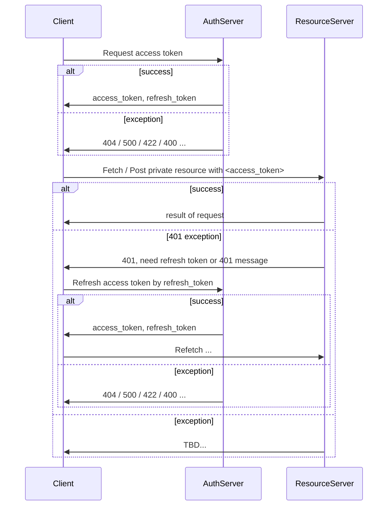

```mermaid
sequenceDiagram
  participant C as Client
  participant A as AuthServer
  participant R as ResourceServer

  C->>A: Request access token
  alt success
    A->>C: access_token, refresh_token
  else exception
    A->>C: 404 / 500 / 422 / 400 ...
  end

  C->>R: Fetch / Post private resource with <access_token>
  alt success
    R->>C: result of request
  else 401 exception
    R->>C: 401, need refresh token or 401 message
    C->>A: Refresh access token by refresh_token
    alt success
    A->>C: access_token, refresh_token
    C->>R: Refetch ...
    else exception
      A->>C: 404 / 500 / 422 / 400 ...
    end
  else exception
    R->>C: TBD...
  end

```