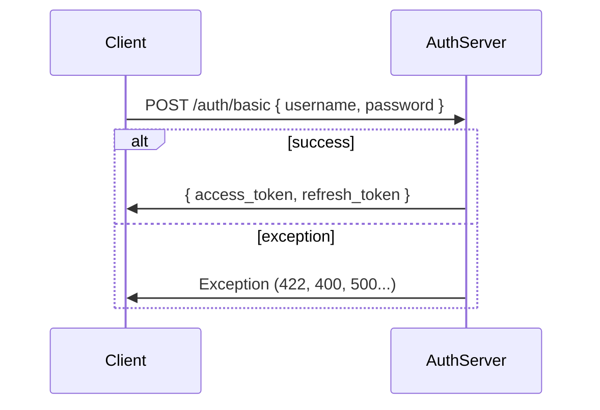
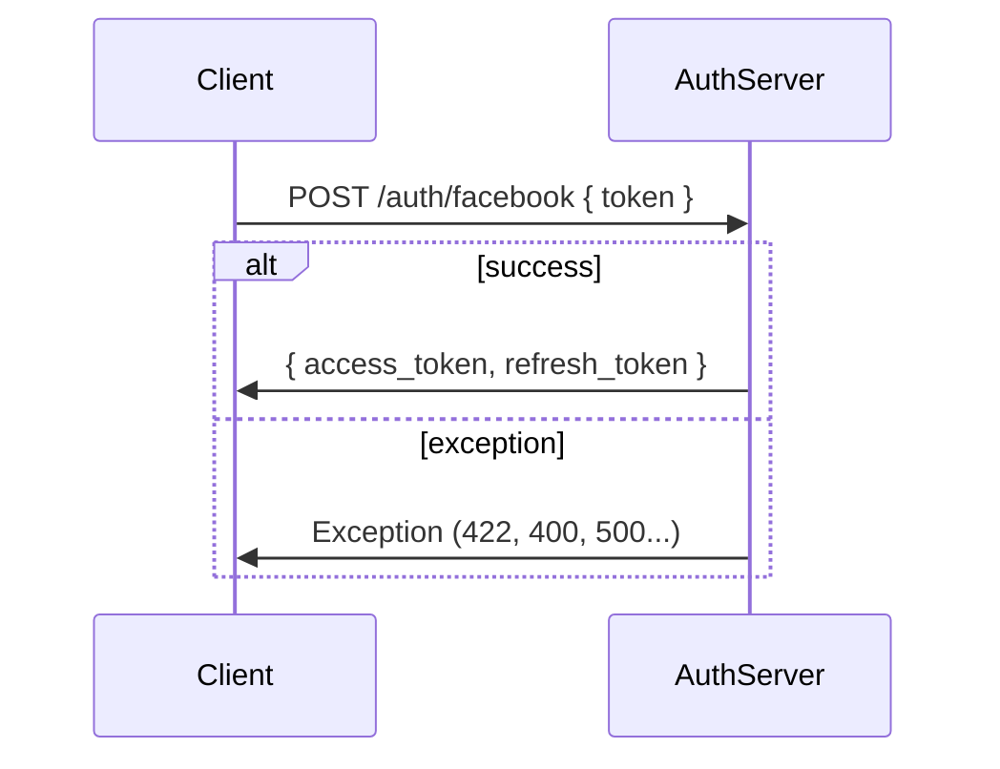
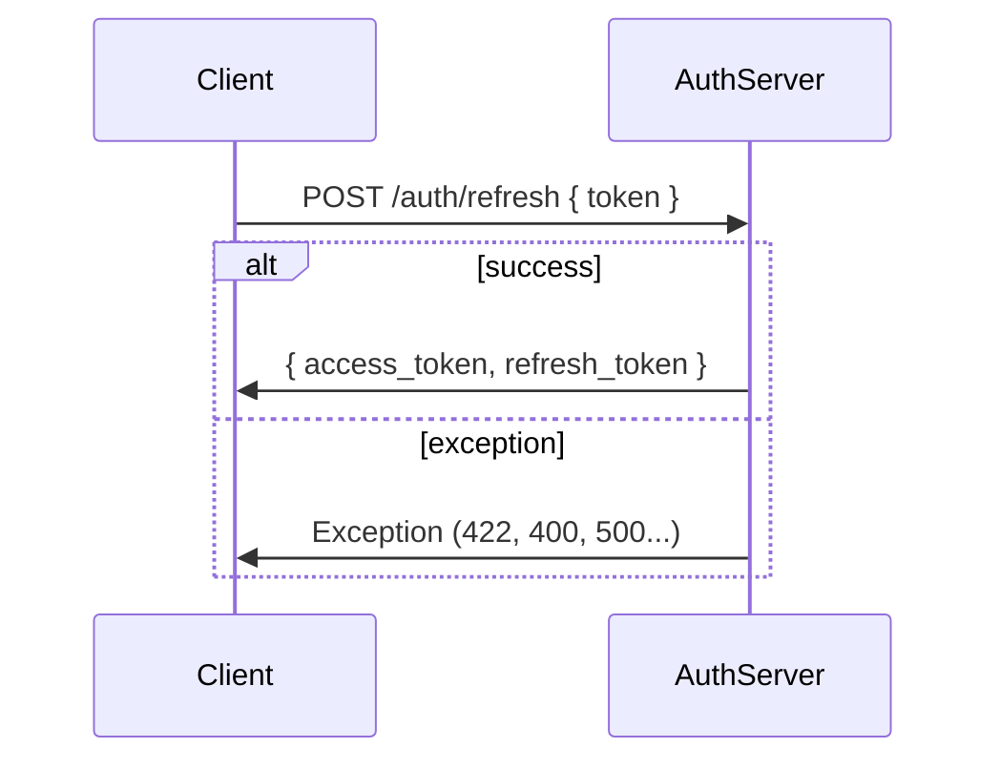

Authenticate with username / password


Authenticate with <provider> (facebook)


Refresh token


Request with credentials
```mermaid
sequenceDiagram
  participant C as Client
  participant R as Server

  C->>A: GET /users/me Authorization: Bearer {access_token}
  alt success
    A->>C: { ...userinfo }
  else exception
    A->>C: Exception (422, 400, 500...)
  end