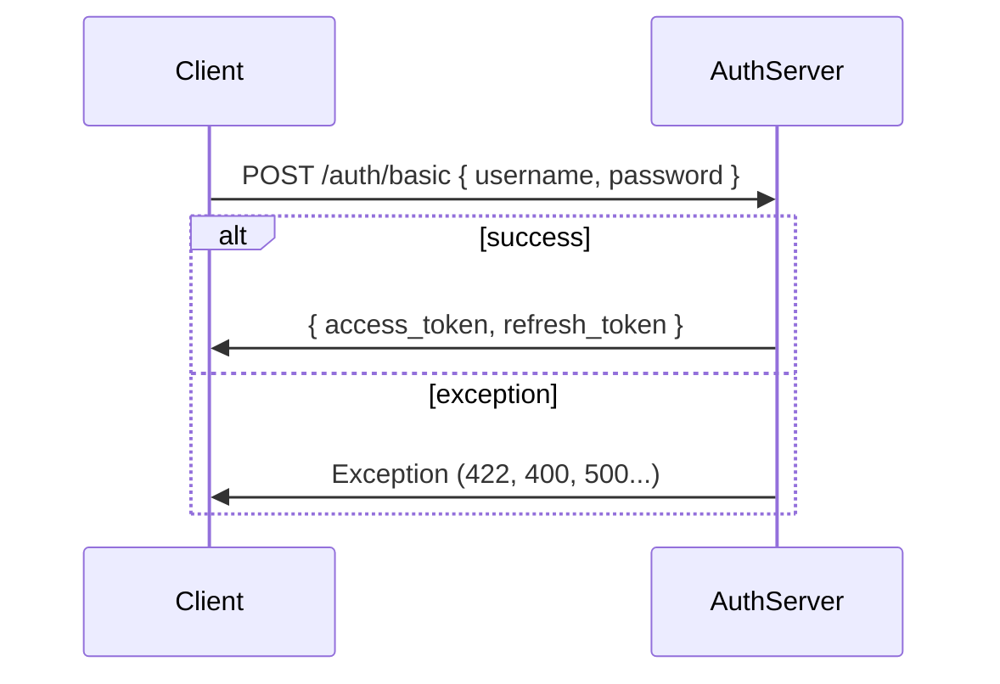
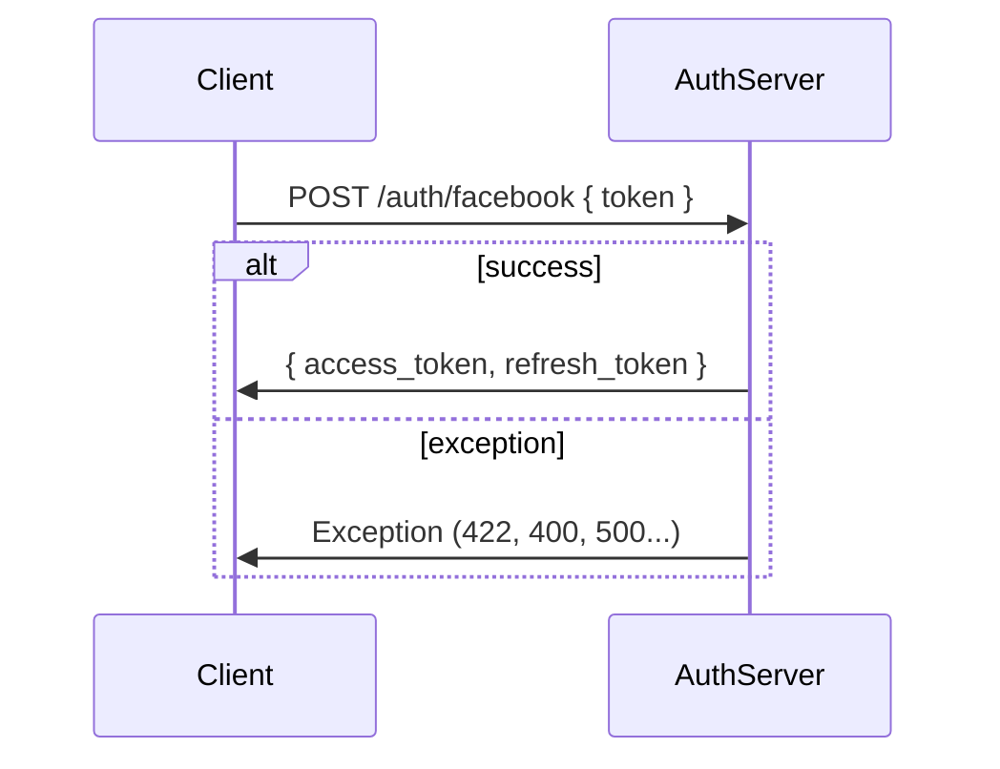
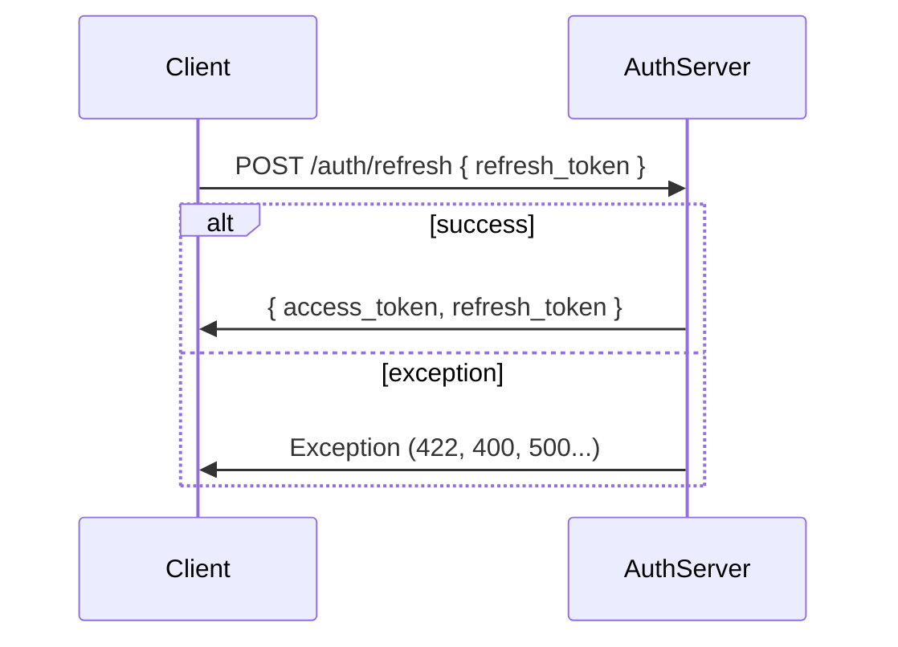
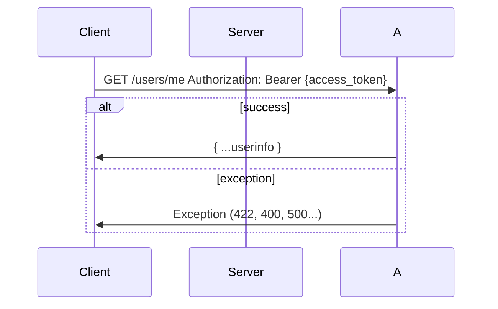

Xử lý đăng nhập (dựa trên passport.js)

Xử lý đăng nhập với kênh đăng nhập bên thứ 3
Authenticate with <provider> (VD: facebook)

Refresh token

Lấy thông tin của đối tượng đăng nhập (thường là người dùng)
Thông tin ngữ cảnh (Authorization token được truyền thông qua Header của giao thức Http)

