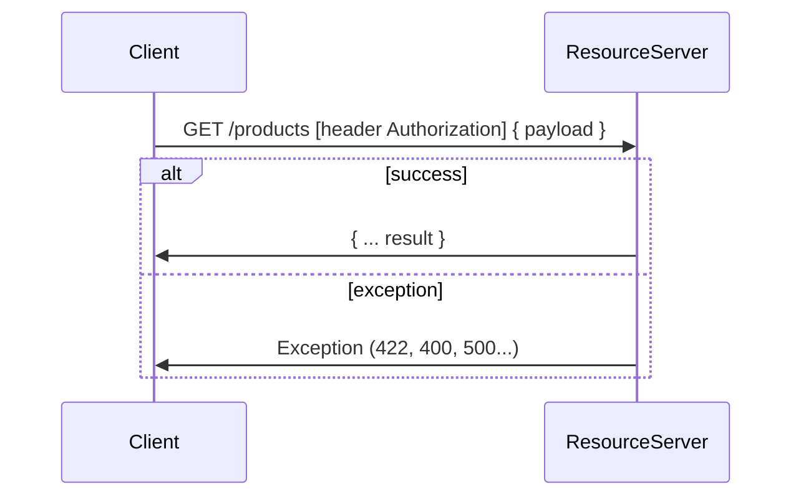

TBD

Fetch API Flow

```mermaid
sequenceDiagram
  participant C as Client
  participant A as ResourceServer

  C->>A: GET /products [header Authorization] { payload }
  alt success
    A->>C: { ... result }
  else exception
    A->>C: Exception (422, 400, 500...)
  end
```
