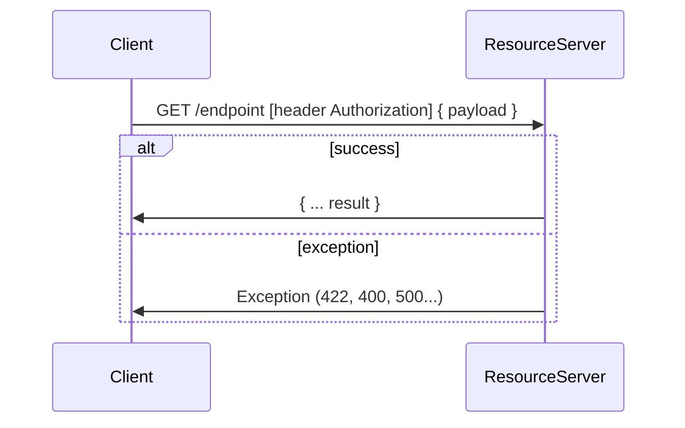

TBD


Fetch API Flow (Tổng quát)


*Common case:*
- Authenticate: Sử dụng header với Authorization đã mô tả ở section (Authenticate)
- Language: Sử dụng header chuẩn (Content-Language) hoặc X-Language / X-Locale
- Sass: Case cho trường hợp xây dựng hệ thống System as Service, Multi ternan: detect dựa vào domain name / custom header
- Version:
  + dùng prefix v<number> (VD: /v1/products), note: để tránh xung đột, endpoint của resource không nên chứa kí tự số.
  + dùng header (Server như của nginx hoặc custom header như restify)

**Best pracetice cho format dữ liệu:**

_Lấy chi tiết 1 entity (VD: product):_

products: Tên đối tượng, nên là số nhiều
-> GET /products/<id>
  <id>: ID của một product

Kết quả trả về 200:

```
{
  field1: value1,
  ...
}
```

_Lấy danh sách:_

GET /products?<query>
query sử dụng là www-urlencode:
  - key=value& ...

**Format**
  Dạng Object:
```
  {
    where: {
      param1: any,
      ...
    },
    limit: number,
    offset: number,
    order: +field1,-field2 ...
  }
```

  Serialize
```
  /products?where[param1]=any&where[param2]=any&offset=2&limit=10&order=+title,-product.quantity
```


Kết quả trả về 200:

```
{
  list: [
    {
      ... tương tự detail
    },
    ...
  ],
  pagination: { // inspire antd pro
    [pageSize],
    [current],
    ...
  }
}
```

*note: Để tránh trường hợp xung đột với 1 số thư viện request client => kết quả trả về của api nên là object (VD: thư viện Volley sử dụng JSONArray / JSONObject là 2 kiểu dữ liệu khác nhau gây lỗi khi parse JSON)*

