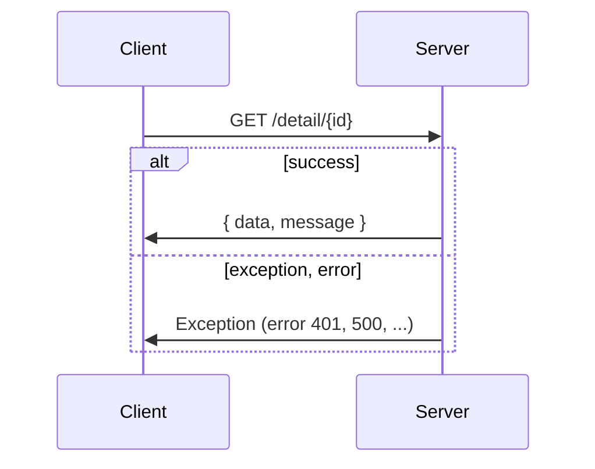
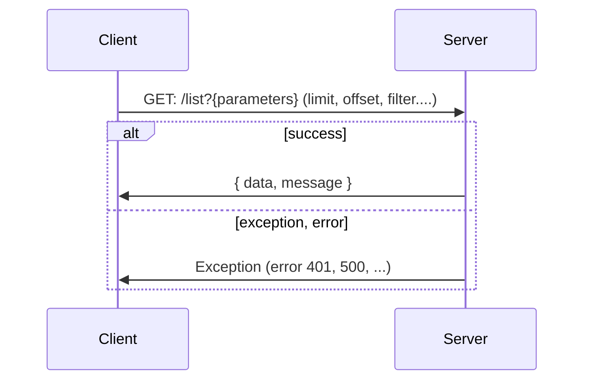

Get detail with {id}

```mermaid
sequenceDiagram
   participant C as Client
   participant S as Server

   C->>S: GET /detail/{id}
   alt success
    S->>C: { data, message }
   else exception, error
    S->>C: Exception (error 401, 500, ...)
   end
```

Get list with {parameters}

```mermaid
sequenceDiagram
   participant C as Client
   participant S as Server

   C->>S: GET: /list?{parameters} (limit, offset, filter....)
   alt success
    S->>C: { data, message }
   else exception, error
    S->>C: Exception (error 401, 500, ...)
   end
```